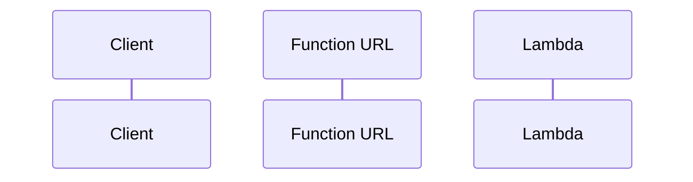
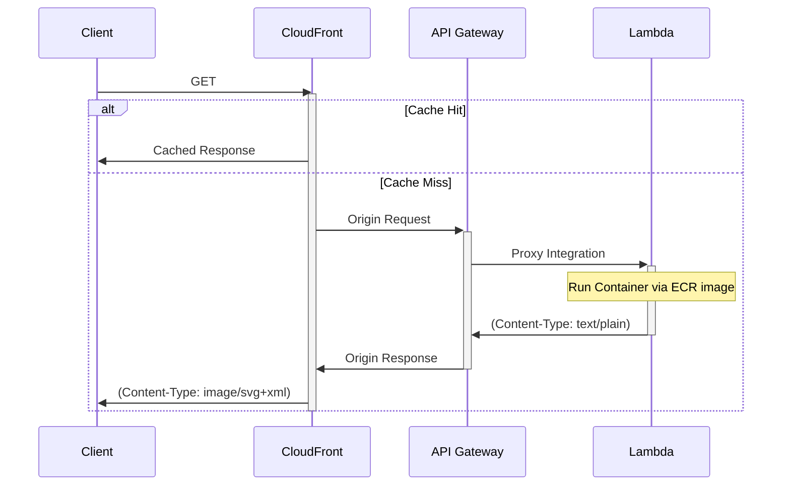

# mermaid-lambda

Mermaid.js as a service — see https://thekevinwang.com/wiki/meta/mermaid for examples.

## Intended usage

This repository is meant to build an OCI image, using Docker.
The image is intended to be run as a stateless container, inside
AWS Lambda.

### Minimal

At a bare minimum, you can run use the image inside AWS lambda,
and create a Lambda Function URL.

- [x] Serverless
- [ ] ~~Custom Domain Name~~
- [ ] ~~Edge Caching~~

### Full

You can also leave add an API Gateway proxy integration, along
with CloudFront CDN. This opens up the door to edge caching,
and custom domain names via the Route53 → CloudFront alias
integration.

- [x] Serverless
- [x] Custom Domain Name (via Route53, ACM, CloudFront)
- [x] Edge Caching

## Todo

**Endpoint Documentation**

**Error handling**

**Security**

> **Warning**
> This is not yet considered a _secure_ implementation.
